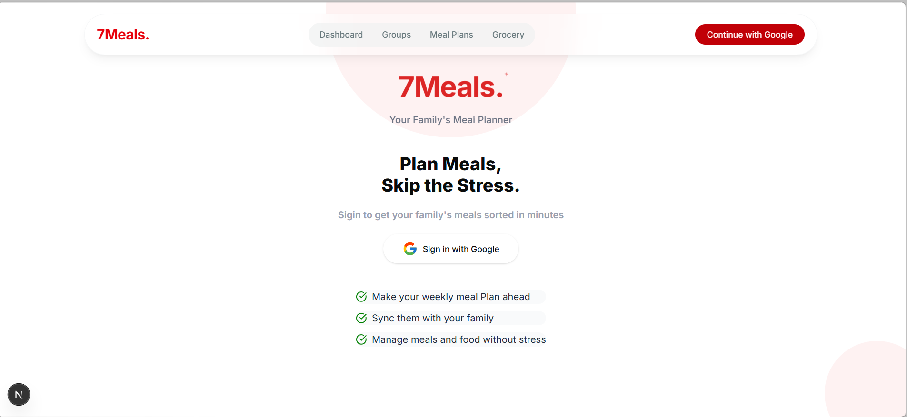

# Seven Meals

## Overview
Seven Meals is a modern web application designed to help users manage their meal plans, grocery lists, and group activities. The application features a responsive navigation bar, user authentication, and integration with Google for seamless sign-in.


## Features
- **Responsive Navigation Bar**: A dynamic navigation bar that adapts to scrolling and screen sizes.
- **Google Sign-In**: Users can log in using their Google accounts.
- **Group Management**: Create and manage groups for meal planning.(In progress ..)
- **Meal Plans and Grocery Lists**: Organize your meals and groceries efficiently.(In progress...)

## Installation
1. Clone the repository:
   ```bash
   git clone <repository-url>
   ```
2. Navigate to the project directory:
   ```bash
   cd seven_meals
   ```
3. Install dependencies:
   ```bash
   npm install
   ```

## Development
To start the development server:
```bash
npm run dev
```

## Build
To create an optimized production build:
```bash
npm run build
```

## Usage
- Navigate through the app using the responsive navigation bar.
- Sign in with Google to access personalized features.
- Manage your groups, meal plans, and grocery lists.(Incoming)

## Technologies Used
- **Next.js**: Framework for building server-rendered React applications.
- **React Icons**: For integrating icons like Google.
- **Tailwind CSS**: Utility-first CSS framework for styling.
- **Supabase**: Backend-as-a-service for authentication and database management.

## Project Structure
```
seven_meals/
├── app/
│   ├── api/
│   │   ├── [...nextauth]/
│   │   ├── groups/
│   │   │   ├── [groupId]/
│   │   │   │   ├── route.js
│   │   │   │   ├── join/
│   │   │   │   │   └── route.js
│   │   │   │   ├── leave/
│   │   │   │   │   └── route.js
│   │   ├── create/
│   │   │   ├── route.js
│   │   │   ├── [groupId]/
│   ├── components/
│   │   ├── Navbar.jsx
│   │   ├── SigIn.jsx
│   │   ├── TextLogo.jsx
│   │   ├── theme.jsx
│   ├── dashboard/
│   │   └── page.jsx
│   ├── fonts/
│   ├── lib/
│   │   └── supabaseClient.js
│   ├── sigin/
│   │   └── page.jsx
├── assets/
│   ├── logo/
│   │   └── logo.jsx
├── components/
│   ├── shadcn-space/
│   │   ├── radix/
│   │   │   ├── blocks/
│   │   │   │   ├── navbar-01/
│   │   │   │   │   └── navbar.jsx
│   ├── ui/
│   │   ├── button.jsx
│   │   ├── dropdown-menu.jsx
│   │   ├── navigation-menu.jsx
├── context/
│   └── AuthContext.js
├── lib/
│   └── utils.js
├── public/
├── supabase/
│   └── public_users.sql
├── AGENTS.md
├── CLAUDE.md
├── components.json
├── eslint.config.mjs
├── jsconfig.json
├── next.config.mjs
├── package.json
├── postcss.config.mjs
├── README.md
```
This structure outlines the organization of the Seven Meals project, including the main application, components, assets, and configuration files.

## License
This project is licensed under the MIT License.